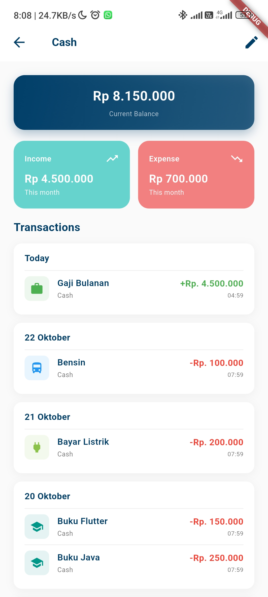

# Moneta_money-expenses-manager


## 📝 Description

Moneta is a mobile-first, Flutter-based personal finance application designed to help users effortlessly manage their income and expenses. Built with a focus on simplicity and user experience, Moneta offers robust authentication features to ensure the security of your financial data. The application is thoroughly tested to provide a reliable and stable experience. Take control of your financial well-being with Moneta and gain valuable insights into your spending habits.

## ✨ Features

### 🔐 Authentication
Secure login and registration system to protect your financial data


---

### �💰 Multi Wallet Management
Create and manage multiple wallets for different purposes (personal, business, savings, etc.)


---

### 💸 Income & Expense Tracking
Record and categorize all your financial transactions with ease


---

### 🔄 Wallet-to-Wallet Transfer
Transfer funds between your wallets seamlessly


---

### 📊 Statistics Dashboard
Visual insights into your financial health with charts and graphs


---

### 📈 Monthly Traffic Analysis
Track income and expense trends per month to understand your spending patterns



---

### 🏷️ Category Management
Organize transactions with customizable income and expense categories


---


## 🛠️ Tech Stack

- 💙 Flutter


## 📦 Key Dependencies

```
name: moneta
description: "A new Flutter project."
publish_to: 'none' # Remove this line if you wish to publish to pub.dev
version: 1.0.0+1
sdk: flutter
cupertino_icons: ^1.0.8
intl: ^0.20.2
flutter_launcher_icons: ^0.13.1
flutter_native_splash: ^2.4.1
flutter_lints: ^5.0.0
uses-material-design: true
android: true
ios: true
image_path: "assets/logo/launcher_icon.png"
adaptive_icon_background: "#ffffff"
```

## 🛠️ Development Setup

### Flutter Setup
1. Install [Flutter SDK](https://flutter.dev/docs/get-started/install)
2. Run: `flutter pub get`
3. Start the app: `flutter run`


## 👥 Contributing

Contributions are welcome! Here's how you can help:

1. **Fork** the repository
2. **Clone** your fork: `git clone https://github.com/zidnafaz/Moneta_money-expenses-manager.git`
3. **Create** a new branch: `git checkout -b feature/your-feature`
4. **Commit** your changes: `git commit -am 'Add some feature'`
5. **Push** to your branch: `git push origin feature/your-feature`
6. **Open** a pull request

Please ensure your code follows the project's style guidelines and includes tests where applicable.

---
*This README was generated with ❤️ by ReadmeBuddy*